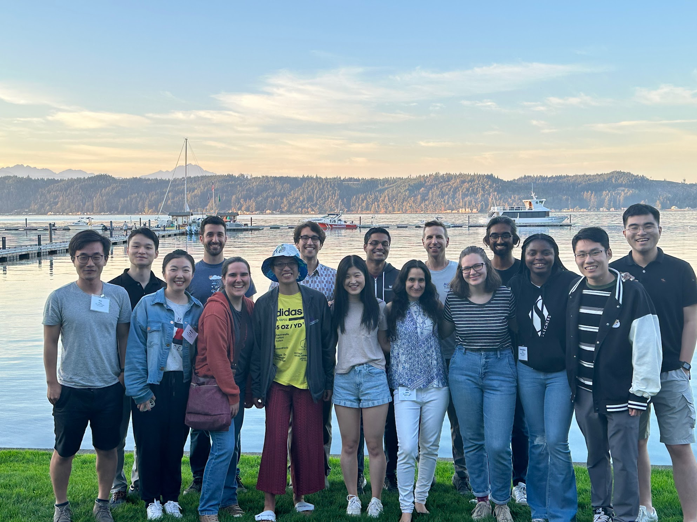

Jump to:  <a href="#current">current members</a>, <a href="#phd">Ph.D. alumni</a>, <a href="#postdoc">postdoctoral alumni</a>, <a href="#masters">masters alumni</a>, and <a href="#other">other alumni</a>

<h3>Current Members</h3>
<table style="border:0px;">
<colgroup>
       <col span="1" style="width: 40%;">
       <col span="1" style="width: 60%;">
    </colgroup>

  <tr style="border:0px;"> <td style="border:0px;"> </td><td style="border:0px;">
          <a href="{{ member.url }}">{{ member.name }}</a>, {{member.role}}</td>
  </tr>

</table>

<h3>Ph.D. Alumni</h3>
<table style="border:0px;">
<colgroup>
       <col span="1" style="width: 20%;">
       <col span="1" style="width: 80%;">
    </colgroup>

  <tr style="border:0px;"> <td style="border:0px;"></td><td style="border:0px;">
          <a href="{{ member.url }}">{{ member.name }}</a>, Ph.D. {{member.year}}, {{member.school}} (<i><a href="{{ member.thesisurl }}">{{ member.thesis }}</a></i>).  {{member.text}}</td>
  </tr>

</table>

<h3>Postdoctoral Alumni</h3>

<table style="border:0px;">
<colgroup>
       <col span="1" style="width: 20%;">
       <col span="1" style="width: 80%;">
    </colgroup>

<tr style="border:0px;"> <td style="border:0px;">
  
  
  
      
  
</td><td style="border:0px;">
<a href="{{ member.url }}">{{ member.name }}</a>, {{member.years}}, {{member.org}}.  Now: {{member.text}}.
</td> </tr>

</table>

<h3>Masters Alumni</h3>
<table style="border:0px;">

<tr style="border:0px;"> <td style="border:0px;">

  
  {{ member.name }}, M.S. {{member.year}}, {{member.school}}
  
  <a href="{{ member.url }}">{{ member.name }}</a>, M.S. {{member.year}}, {{member.school}} 
  
 </td></tr>

</table>

<h3>Other ARK Associates</h3>
Undergraduates, research programmers, visitors, etc. 
<table style="border:0px;">

<tr style="border:0px;"> <td style="border:0px;">
  
  
 	{{ member.name }} ({{member.type}}, {{member.years}})
  
    <a href="{{ member.url }}">{{ member.name }}</a> ({{member.type}}, {{member.years}})
  
</td></tr>

</table>
